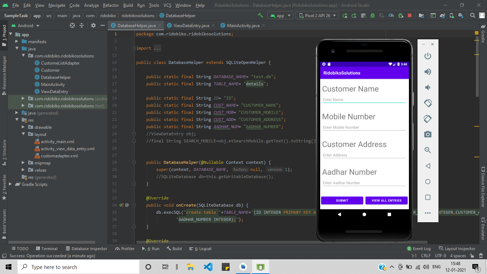
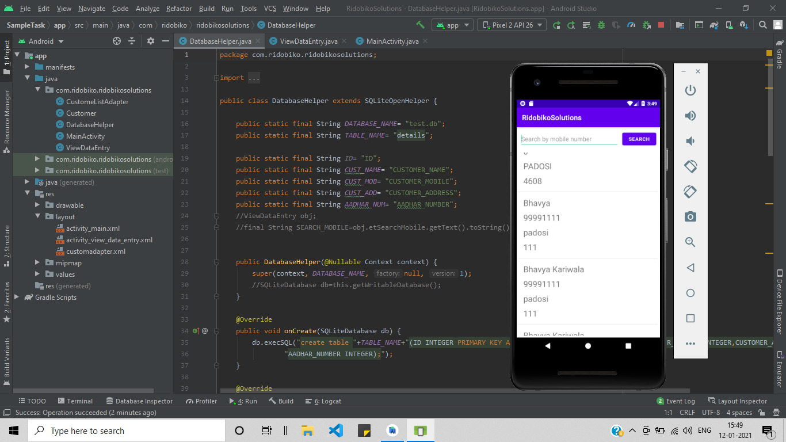

# Database-Storage_App

Android Application developed using Android Studio.
Uses SQLite to connect to a Database and perform SQL Queries.

Functionalities include:
1. Enter Name, Mobile Number, Address and AADHAR Number and store them in a database.
2. Fetch all the Entries done by the User.
3. Search within all the Entries by Mobile Number.

## Screenshots

    
    

